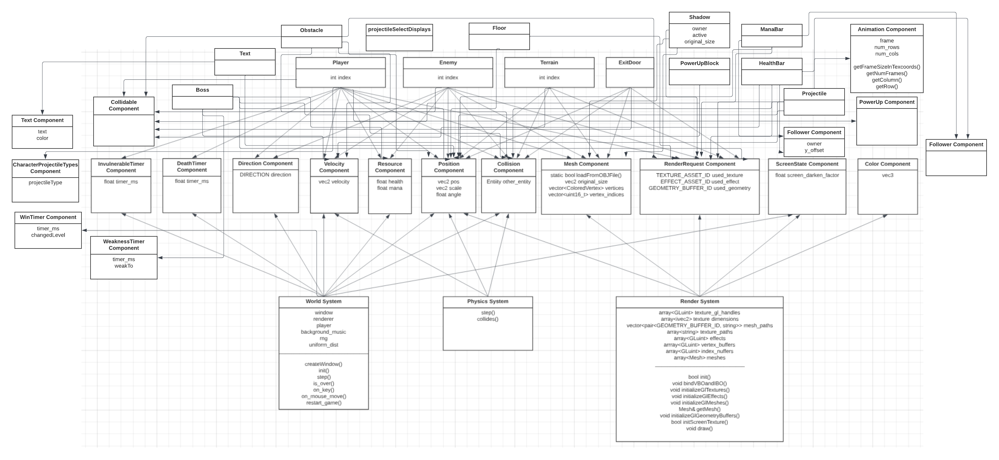

# Aria: Whispers of Darkness
In the eerie village of Grimhaven, shrouded in perpetual mist and shadows, Aria's journey begins. 

# Milestone 4
Below is the documentation for our `README.md` submission for Milestone 4.

## User-game interactions
### Changes implemented + rationale

## Entry Points
### Advanced Integrated Assets
- Assets created by the team
- Assets from other sources
### Advanced Story Elements

## Game balance
### Changes implemented + rationale

## Development Plan
Most of the work in this milestone aligned with our development plan for this milestone.

### Aligned with the proposal:
- Balanced game
- Tutorial implementation finished
- Fixed all bugs from previous milestones
- Finished sprites
- Added many new sounds (music and sound effects)

### Discreprancies:
- Did not do parallax background scrolling creative component
- Decided to use advanced integrated assets creative component

## ECS Design Pattern
The ECS design pattern has not been changed since Milestone 1.

## Game Entities
- Player
- Enemy
- Terrain
- Exit Door
- Projectile
- Text
- Health Bar
- Floor
- PowerUpBlock
- Shadow
- Obstacle
- Boss

### New Game Entities:

## Actionable Components
- Velocity
- Position
- Collision
- Direction
- Invulnerable Timer
- Death Timer
- Resources
- Mesh
- Render Request
- Screen State
- Color
- Projectile
- Text
- CharacterProjectileType
- Collidable
- Win Timer
- Animation
- Power Up
- Follower

### New Actionable Components
- WeaknessTimer

## Entity Component Diagram
Highlight any changes versus the previous milestone.

