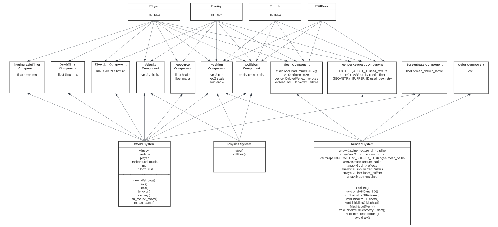

# Aria: Whispers of Darkness
In the eerie village of Grimhaven, shrouded in perpetual mist and shadows, Aria's journey begins. 

# Milestone 1
Below is the documentation for our `README.md` submission for Milestone 1.

## Entry Points
- [Movement Controls](https://github.students.cs.ubc.ca/CPSC427-2023W-T1/Team06Aria/blob/0d59974eadc6cf1e6482af4443dfe1ed5fba9fb9/src/world_system.cpp#L270)
- Camera Controls: [Camera struct](https://github.students.cs.ubc.ca/CPSC427-2023W-T1/Team06Aria/blob/d37c69f8169b5c6068eda0682ba48fa821cc33ef/src/common.hpp#L51),  [function call and projection matrix](https://github.students.cs.ubc.ca/CPSC427-2023W-T1/Team06Aria/blob/d37c69f8169b5c6068eda0682ba48fa821cc33ef/src/render_system.cpp#L205), [function definition](https://github.students.cs.ubc.ca/CPSC427-2023W-T1/Team06Aria/blob/d37c69f8169b5c6068eda0682ba48fa821cc33ef/src/common.cpp#L24)
- [Collisions World System](https://github.students.cs.ubc.ca/CPSC427-2023W-T1/Team06Aria/blob/0d59974eadc6cf1e6482af4443dfe1ed5fba9fb9/src/world_system.cpp#L217)
- [Collisions Physics System](https://github.students.cs.ubc.ca/CPSC427-2023W-T1/Team06Aria/blob/0d59974eadc6cf1e6482af4443dfe1ed5fba9fb9/src/physics_system.cpp#L32)
  - Collisions also handle the game space boundaries by disallowing players to step out of certain spaces.
- [Geometry of new assets](https://github.students.cs.ubc.ca/CPSC427-2023W-T1/Team06Aria/blob/eac2392bd085313bd47088c7d778549e9295cd7e/src/render_system_init.cpp#L166)
- Game Level Assets: [hpp](https://github.students.cs.ubc.ca/CPSC427-2023W-T1/Team06Aria/blob/eac2392bd085313bd47088c7d778549e9295cd7e/src/game_level.hpp), [cpp](https://github.students.cs.ubc.ca/CPSC427-2023W-T1/Team06Aria/blob/eac2392bd085313bd47088c7d778549e9295cd7e/src/game_level.cpp)
- [Projectile Controls](https://github.students.cs.ubc.ca/CPSC427-2023W-T1/Team06Aria/blob/1abb653a8c08b16c6a2b29b3be8313c48e31a219/src/world_system.cpp#L364)

## Development Plan
Most of the work in this milestone aligned with our development plan for this milestone.

### Aligned with the proposal:
- Drafting sprite assets.
- Getting the ECS design pattern implemented.
- Getting movement inputs implemented.
- Collision properties (with walls and enemies).
- Bug fixing and game stability checking.

### Discreprancies:
- Solidified the decisions for our creative components for this milestone to be `Camera Control` and `Audio Feedback`.
- Gray-box-implementation was "changed" to salmon-box-implementation (we used the A1 assets instead of creating "gray-box" assets).
- Replaced Key-frame/state interpolation task with an Enemy Decision Tree feature.

## ECS Design Pattern
The ECS design pattern we are using is the one provided by A1 which is a dense component and entity vector with a map.

### Implementation:
`std::vector<Entity> entities`\
`std::vector<Component> components`\
`std::unorderedmap<unsignedint, unsignedint>`

## Game Entities
- Player
- Enemy
- Terrain
- Exit Door

## Actionable Components
- Velocity
- Position
- Collision
- Direction
- Invulnerable Timer
- Death Timer
- Resource
- Mesh
- Render Request
- Screen State
- Color

## Entity Component Diagram

