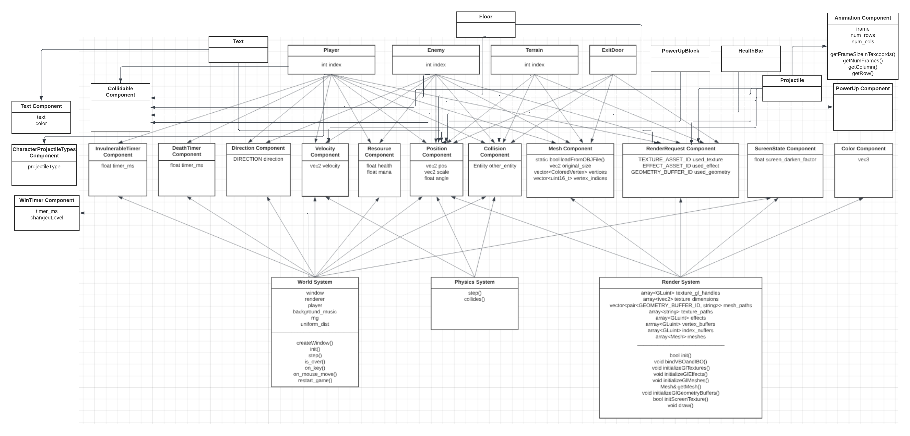

# Aria: Whispers of Darkness
In the eerie village of Grimhaven, shrouded in perpetual mist and shadows, Aria's journey begins. 

# Milestone 3
Below is the documentation for our `README.md` submission for Milestone 3.

## Entry Points
- **Sprite sheet animation** (prior milestone fix): adapted to accomodate sprite sheets with rows and partitions frames into animation states. 
[Initializing sprite sheets](https://github.students.cs.ubc.ca/CPSC427-2023W-T1/Team06Aria/blob/8c1ac9ec1c7e2da38d80536bf5c18bd55f0c68fd/src/render_system_init.cpp#L296), 
[Passing in shader parameters](https://github.students.cs.ubc.ca/CPSC427-2023W-T1/Team06Aria/blob/8c1ac9ec1c7e2da38d80536bf5c18bd55f0c68fd/src/render_system.cpp#L91), 
[Shader implementation](https://github.students.cs.ubc.ca/CPSC427-2023W-T1/Team06Aria/blob/8c1ac9ec1c7e2da38d80536bf5c18bd55f0c68fd/shaders/animated.fs.glsl#L84).
- **Simple rendering effects** (prior milestone fix): 2 shader effects, 
[Spotlight](https://github.students.cs.ubc.ca/CPSC427-2023W-T1/Team06Aria/blob/8c1ac9ec1c7e2da38d80536bf5c18bd55f0c68fd/shaders/screen_darken.fs.glsl#L21) and 
[Rainbow](https://github.students.cs.ubc.ca/CPSC427-2023W-T1/Team06Aria/blob/8c1ac9ec1c7e2da38d80536bf5c18bd55f0c68fd/shaders/animated.fs.glsl#L70).
- **Consistent game resolution** (TODO: ADD LINK)
- **Basic Integrated Assets**: 
Player Sprite (TODO: ADD LINK), 
Enemy Sprites (water, fire, earth, air, ghost; TODO: ADD LINKS),
Boss Sprites (TODO: ADD LINK),
New Music (TODO: ADD LINK),
[Power-up Block Sprite](https://github.students.cs.ubc.ca/CPSC427-2023W-T1/Team06Aria/blob/8c1ac9ec1c7e2da38d80536bf5c18bd55f0c68fd/data/textures/power_up_block.png),
[Projectile Select Display Sprite](https://github.students.cs.ubc.ca/CPSC427-2023W-T1/Team06Aria/blob/8c1ac9ec1c7e2da38d80536bf5c18bd55f0c68fd/data/textures/projectile-select-display-purple.png),
[Portal Sprite](https://github.students.cs.ubc.ca/CPSC427-2023W-T1/Team06Aria/blob/8c1ac9ec1c7e2da38d80536bf5c18bd55f0c68fd/data/textures/portal.png).
- **2D Dyanmic Shadows**
- **Basic Story Elements**

## Development Plan
Most of the work in this milestone aligned with our development plan for this milestone.

### Aligned with the proposal:

### Discreprancies:

## ECS Design Pattern
The ECS design pattern has not been changed since Milestone 1 and 2.

## Game Entities
- Player
- Enemy
- Terrain
- Exit Door
- Projectile
- Text
- Health Bar
- Floor
- PowerUpBlock

### New Game Entities:

## Actionable Components
- Velocity
- Position
- Collision
- Direction
- Invulnerable Timer
- Death Timer
- Resources
- Mesh
- Render Request
- Screen State
- Color
- Projectile
- Text
- CharacterProjectileType
- Collidable
- Win Timer
- Animation
- Power Up

### New Actionable Components

## Entity Component Diagram
Highlight any changes versus the previous milestone.

